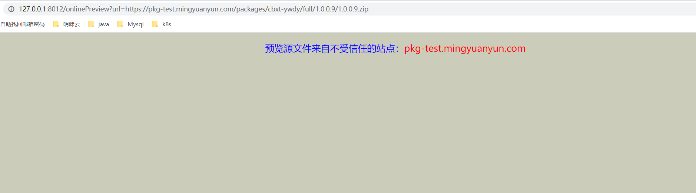

#文件预览方案
## 背景
应用市场后台提供版本的详情查询以及包文件的预览功能，包文件的预览功能方便后台管理人员检查包文件的内容，提前发现包内容的完整性和准确性

## 需求调研和分析
针对文件预览功能，需要关注的问题点是：
1、上传的文件包需要解压，那上传的文件压缩包的文件类型有哪些
目前上传的压缩包固定的格式是zip，不允许上传其他格式的

2、文件包的内容各种各样，从技术实现上考虑不可能保证预览功能支持所有格式的文件预览，前期考虑可以固定哪些文件需要预览功能

文件类型的格式有：
- 文本类型：txt, html, htm, asp, jsp, xml, json, properties, md, gitignore, log, java, py, c, cpp, sql, sh, bat, bas, cmd
- 多媒体类型：mp3, wav, mp4, flv
- office类型：Word, PPT, Excel
- 图片类型：jpg, png, jpeg

诸如此类，还有一些编程项目里的命名文件如.config、.class等格式的，文件的类型多种多样，实现成本考虑，没必要满足所有的文件类型的预览，可以指定规范部分的文件类型的预览，
如有特殊需求，可以向应用市场提需求去实现另外文件类型的预览。目前规范可预览的文件类型的格式列表为：excel，word，xml，properties

3、压缩包里的文件是不可控的，文件夹层级可能比较多，需要穿透多层级去预览可预览格式的文件吗？

这个可以限定文件夹，统一定义好需要预览的文件夹，其他文件夹的内容不予处理

## 实现方案
针对office类型，目前比较成熟的文件预览案例主要是百度文库，百度文库实现了ppt、word、excel、pdf等格式文件的预览，参见百度文库

当前流行的office在线预览方案是通过openoffice将word/ppt/excel转换为pdf，当前主流的浏览器都是支持直接打开pdf格式文件。OpenOffice是一套跨平台的办公室软件套件，能在Windows/Linux等操作系统上执行

借助linux命令行工具实现

1）调用unoconv命令将 doc、ppt 转 pdf

2）使用 imagemagick将 pdf 转图片

unoconv，全称为 Universal Office Converter ，是一个命令行工具，可在 LibreOffice/OpenOffice 支持的任意文件格式之间进行转换。

unoconv 支持批量转换文档，还可以结合 asciidoc和 docbook2odf / xhtml2odt 来创建 PDF 或 Word（.doc）文件

ImageMagick是强大的图像处理工具，他的强大之处在于Linux与生俱来的命令行特性，基于命令行的一系列工具可以让你完成、处理常见的图像操 作，诸如生成缩略图，缩放，查看信息，加注标题，水印等等


---
安装：yum -y install unoconv

使用：

word文档转为pdf

unoconv -f pdf /root/qipa250.docx
pdf转为图片，%d是按页进行转换

convert XXX.pdf %d.jpg

需要实现的功能包括：

1、文件流的处理

2、异步实现文件的转换，文件上传文件服务器

3、提供接口获取转换后的文件列表

4、临时文件的清理

5、权限的管控

此方案针对office文件的处理是可行的，但针对其他文件类型的处理需要另外处理，同时严重依赖服务器环境，开发成本太高


---
## 开源项目实现——kkFileView

该项目使用流行的spring boot搭建，易上手和部署，基本支持主流办公文档的在线预览，如doc,docx,Excel,pdf,txt,zip,rar,图片等等

项目特性
- 支持word excel ppt，pdf等办公文档
- 支持txt,java,php,py,md,js,css等所有纯文本
- 支持zip,rar,jar,tar,gzip等压缩包
- 支持jpg，jpeg，png，gif等图片预览（翻转，缩放，镜像）
- 支持mp3，mp4，flv等多媒体文件预览
- 使用spring boot开发，预览服务搭建部署非常简便
- rest接口提供服务，跨平台特性(java,php,python,go,php，....)都支持，应用接入简单方便
- 支持普通http/https文件下载url、http/https文件下载流url、ftp下载url等多种预览源
- 提供zip，tar.gz发行包，提供一键启动脚本和丰富的配置项，方便部署使用
- 提供Docker镜像发行包，方便在容器环境部署
- 抽象预览服务接口，方便二次开发，非常方便添加其他类型文件预览支持
- Apache协议开源

通过配置化实现cache文件的清理，可配置可信任站点，防止无关文件的预览导致临时文件的存储压力

提供api接口入队方式提前保证预览文件缓存

word文档预览效果

图片预览模式预览效果如下
word文档预览1

pdf预览模式预览效果如下
word文档预览2

PPT转pdf和图片预览效果


文件预览服务提供方式
1. 提供sdk，添加文件预览服务依赖，通过service调用
2. 提供独立的http服务
考虑到预览特性，文件预览服务不提供文件上传功能，只提供可访问url的文件包预览

使用方式

文件预览服务部署完成后，预览路径为：http://127.0.0.1:8012/onlinePreview?url=xxx，url后面接入远程可访问的文件链接

项目需要接入文件预览项目，达到对docx、excel、ppt、jpg等文件的预览效果，那么通过在你的项目中加入下面的代码就可以 成功实现：
```javascript 1.8
var url = 'http://127.0.0.1:8080/file/test.txt'; //要预览文件的访问地址
window.open('http://127.0.0.1:8012/onlinePreview?url='+encodeURIComponent(url));
```

文件流处理

业务模板生成的下载链接格式为https://rdc-test.mingyuanyun.com/rdc-file-service/api/v2/files/8ace3378-d549-4c7d-bf48-8252a49da0a8/download

业务单元下载链接格式为https://pkg-test.mingyuanyun.com/packages/cbxt-ywdy/full/1.0.0.9/1.0.0.9.zip

下载的链接这里需要区分处理，针对不能从url上获取文件名的链接，需要获取请求头获取解析Content-Disposition里的filename字段获取文件名
```java
URL url = new URL(urlStr);
URLConnection connection = url.openConnection();
if (connection instanceof HttpURLConnection) {
    connection.setRequestProperty("User-Agent", "Mozilla/4.0 (compatible; MSIE 5.0; Windows NT; DigExt)");
}
 
String field = connection.getHeaderField("Content-Disposition");
String fileName = URLDecoder.decode(field.substring(field.lastIndexOf("filename") + 17, field.length()), "UTF-8");
```

配置项

缓存实现类型，不配默认为内嵌RocksDB(type = default)实现，可配置为redis(type = redis)实现（需要配置spring.redisson.address等参数）和 JDK 内置对象实现（type = jdk）
```yaml
#redis配置
KK_SPRING_REDISSON_ADDRESS = 10.5.10.118:6379
KK_SPRING_REDISSON_PASSWORD = Mysoft95938
 
cache.type = ${KK_CACHE_TYPE:redis}
#redis连接，只有当cache.type = redis时才有用
spring.redisson.address = ${KK_SPRING_REDISSON_ADDRESS:127.0.0.1:6379}
spring.redisson.password = ${KK_SPRING_REDISSON_PASSWORD:123456}
```

缓存定时清理，可以在配置文件里设置cron，定时清理redis里的数据以及生成的file下的临时文件
```yaml
#缓存是否自动清理 true 为开启，注释掉或其他值都为关闭
cache.clean.enabled = ${KK_CACHE_CLEAN_ENABLED:true}
#缓存自动清理时间，cache.clean.enabled = true时才有用，cron表达式，基于Quartz cron
cache.clean.cron = ${KK_CACHE_CLEAN_CRON:0 0 3 * * ?}#缓存是否自动清理 true 为开启，注释掉或其他值都为关闭

```

提供文件预览服务，需要管控一些恶意的攻击或者白名单外的链接导致临时文件对存储的占用，可以设置可信任的站点
```yaml
#信任站点，多个用','隔开，设置了之后，会限制只能预览来自信任站点列表的文件，默认不限制
trust.host = ${KK_TRUST_HOST:default}
```
测试信任站点控制



安装部署
```shell script
docker build -t nexus.mingyuanyun.com:5000/java/file-preview-service:1.0.0 -f Dockerfile .
docker run -it -p 8012:8012 nexus.mingyuanyun.com:5000/java/file-preview-service:1.0.0
```


